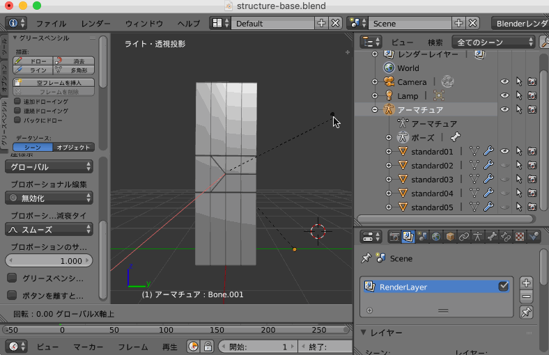
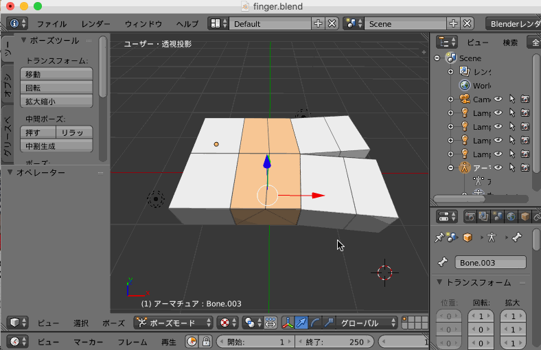

# ベースとなるモデルを検討するリポジトリ

## structure-base

Blender で [Auto Weight Paint - Ctrl + P] を実行した際に割り当てられる仕組みを理解するためのもの

### model

|bone|cut|auto weight paint|
|---|---|---|
||||

### move

関節部分に相当するポリゴン数を減らした場合どうなるかの検証

今回はわかりやすさのためにメッシュを UV 画像として展開して表現してみた

|base|less|
|---|---|
|||

よって関節部分は広い方が

* テクスチャは大きく変化してしまうのでつぶれやすく
* ポリゴンは変化領域が広いので自動ウェイトで周囲(関節に近いポリゴン)が影響を受けにくい

このあと最大まで減らしたケースまで検証してみたが

|least|
|---|
||

あまり支障なさそうにみえた

ただし、この検証によって 90 度曲げたい場合は関節部分がxz軸平面において `縦 >= 横` でなければポリコンがめり込んでしまうことがわかった

## finger

指の構造を理解するためのモデル

|人差指と中指を模した第三関節の動き|
|---|
||
